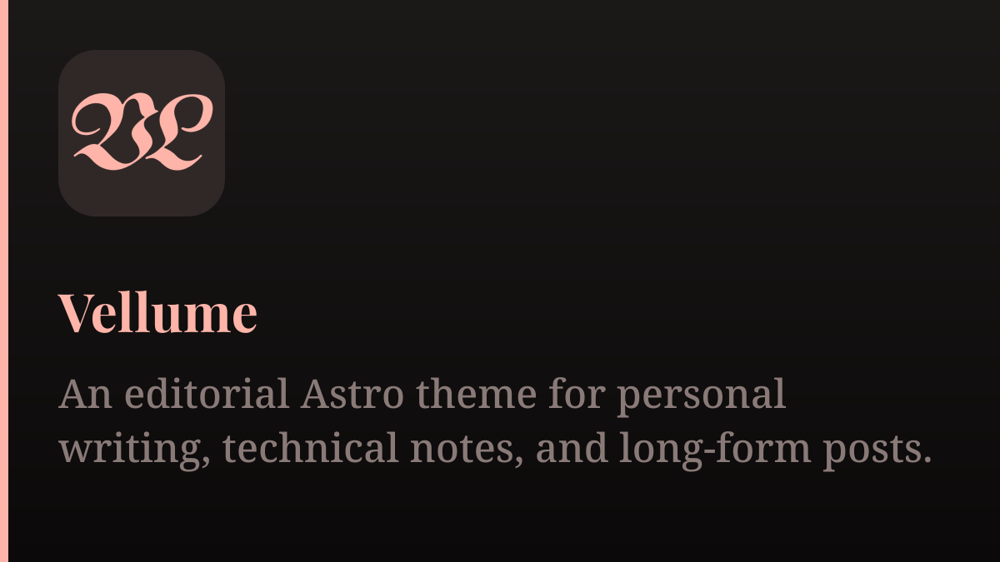

# Vellume

An editorial Astro theme for personal writing, technical notes, and long-form posts.

Vellume is an Astro theme for blogs, notes, and essays. In code, it is built around a few concrete ideas: posts and series are both first-class content types, the homepage can mix them in one feed, discovery is organized by series, tags, and archive, and article pages keep metadata, table of contents, and navigation close at hand.

That gives the theme a calmer, more editorial shape. It is meant for sites that will keep growing over time, not just for a front page with a reverse-chronological post list.



## Why Vellume

Vellume is designed for a different content structure than the usual "all posts in one timeline" blog. Its default shape is:

- warm, paper-like color and typography
- a homepage that can show both standalone posts and series
- a discovery flow built around series, tags, and archive browsing
- article pages that support longer reading sessions
- strong Markdown support without pushing runtime rendering into the browser

If you want a personal site that treats structure and readability as core features, that is the direction here.

## Highlights

- Editorial homepage with a mixed feed of standalone posts and series
- Discovery page for browsing by series, tags, and archive timeline
- Reading-focused article pages with word count, reading time, table of contents, and series navigation
- Local full-text search powered by Pagefind
- RSS, sitemap, favicons, SEO metadata, and generated Open Graph images
- Light and dark theme support with smooth page transitions
- Code copy, image zoom, mobile drawer navigation, and article sidebar helpers
- Optional Artalk comments with theme-aware styling
- Astro Content Collections for typed content modeling
- Build-time rendering for Typst math and Mermaid/Typst diagrams as static SVG assets

## Tech Stack

- [Astro 6](https://astro.build/)
- [Tailwind CSS v4](https://tailwindcss.com/)
- TypeScript
- Astro Content Collections
- Shiki
- Pagefind
- astro-og-canvas
- Three.js
- Artalk

## Design Direction

The design is built around a few simple decisions:

- Content should have a clear center instead of too many competing regions.
- Typography should create rhythm and hierarchy before components try to.
- Visual identity should be present, but it should never overpower the article itself.
- Motion should be restrained and atmospheric, not decorative noise.

That is why the theme uses serif headings, wider spacing, soft borders, muted cards, and a warmer palette than the default look many technical blogs end up with.

## Content Model

The repository already includes a complete writing structure:

- `src/content/blog`
  Stores blog posts. Recommended structure: `src/content/blog/<yyyy-mm>/<slug>/index.md`
- `src/content/series`
  Stores series metadata and allows posts to be grouped into a narrative sequence
- `src/content/about`
  Stores the about page content

Each post supports:

- `title`
- `slug`
- `description`
- `publishedAt`
- `updatedAt`
- `tags`
- `series`
- `visibility` with `public`, `unlisted`, and `draft`

This makes the theme suitable for ongoing publishing instead of a one-off content dump.

## Writing Features

Vellume supports standard Markdown plus a few features that matter in technical writing and longer articles:

- syntax-highlighted code blocks
- reading time estimation
- automatic heading ids and article table of contents
- responsive images stored next to the article
- Typst-rendered math
- Mermaid and Typst diagrams rendered as static SVG

The main difference is that diagrams and math are compiled at build time instead of rendered in the browser. That keeps the output more stable and easier to maintain.

## Requirements

- Node.js `>= 22.12.0`
- `pnpm`

For the advanced sample content included in this repository, you should also have these commands available in `PATH`:

- `typst`
- `mmdr`

They are used to compile math and diagram assets during the build. If you remove those content blocks from your posts, you may not need both tools for everyday writing.

## Quick Start

```bash
git clone git@github.com:TimFang4162/astro-theme-vellume.git
cd astro-theme-vellume
pnpm install
pnpm dev
```

Open `http://localhost:4321`.

## Useful Commands

```bash
pnpm dev
pnpm build
pnpm preview
pnpm check:astro
pnpm check:biome
```

## Customize The Site

The usual starting points are:

1. Edit `src/config/site.ts` to change site title, description, author info, links, and comment settings.
2. Rewrite `src/content/about/index.md`.
3. Replace the sample posts under `src/content/blog`.
4. Add or remove navigation items in `src/data/navigation.ts`.
5. Enable Artalk comments if you want discussion and page stats.

## Project Structure

```text
.
├── public/
├── src/
│   ├── assets/
│   ├── components/
│   ├── config/
│   ├── content/
│   │   ├── about/
│   │   ├── blog/
│   │   └── series/
│   ├── layouts/
│   ├── lib/
│   ├── markdown/
│   ├── pages/
│   ├── scripts/
│   └── styles/
├── astro.config.ts
├── package.json
└── tsconfig.json
```

## Who This Theme Is For

Vellume is a good fit if you are publishing:

- technical blog posts
- learning notes
- research-style writing
- project journals
- essays and long-form personal writing
- themed article series

It is less suitable if your main goal is a highly animated landing page or a feed dominated by widgets and side panels.

## Inspiration

While building Vellume, I also looked at a few Astro themes that handle documentation, packaging, and defaults especially well:

- [astro-theme-pure](https://github.com/cworld1/astro-theme-pure)
- [AstroPaper](https://github.com/satnaing/astro-paper)
- [mizuki](https://github.com/matsuzaka-yuki/mizuki)

They all take different approaches, but each of them helped clarify what should be documented clearly and what should already work out of the box.

## Notes

- The default site config still uses placeholder author metadata and links.
- The repository includes sample articles intended to demonstrate the theme's capabilities.
- The build output is fully static.
