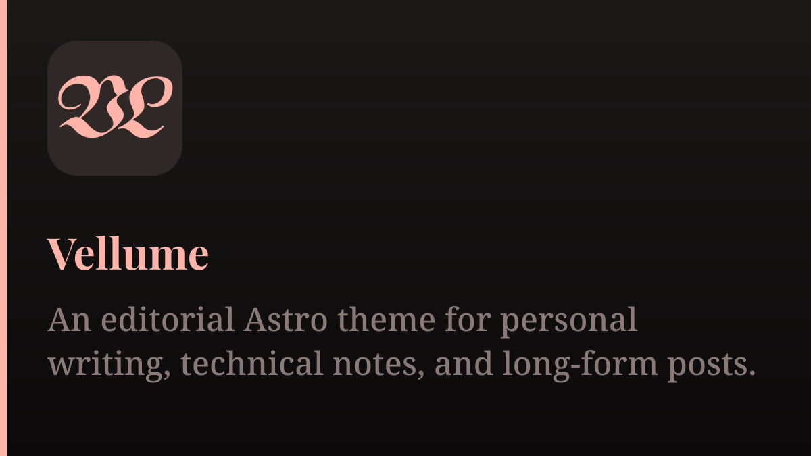

# Vellume

A calm, document-first Astro theme for personal writing, technical notes, and long-form posts.

Vellume is an Astro theme for blogs, notes, and essays. In code, it is built around a few concrete ideas: posts and series are both first-class content types, the homepage can mix them in one feed, discovery is organized by series, tags, and archive, and article pages keep metadata, table of contents, and navigation close at hand.

The result reads like a well-made tool rather than a decorated page. It is meant for sites that will keep growing over time, not just for a front page with a reverse-chronological post list.



Demo: <https://timfang4162.github.io/astro-theme-vellume/>

## Why Vellume

Vellume is designed for a different content structure than the usual "all posts in one timeline" blog. Its default shape is:

- a neutral, document-first surface with a single blue accent
- a homepage that can show both standalone posts and series
- a discovery flow built around series, tags, and archive browsing
- article pages that support longer reading sessions
- strong Markdown support without pushing runtime rendering into the browser

If you want a personal site that treats structure and readability as core features, that is the direction here.

## Highlights

- Document-first homepage with a mixed feed of standalone posts and series
- Discovery page for browsing by series, tags, and archive timeline
- Reading-focused article pages with word count, reading time, table of contents, series navigation, and hover-revealed heading permalinks
- Local full-text search powered by Pagefind
- RSS, sitemap, favicons, SEO metadata, and generated Open Graph images
- Light and dark theme support with smooth page transitions
- Code copy, image zoom, mobile drawer navigation, and article sidebar helpers
- Optional Artalk comments with theme-aware styling
- Astro Content Collections for typed content modeling
- Build-time rendering for Typst math and Mermaid/Typst diagrams as static SVG assets

## Tech Stack

- [Astro 6](https://astro.build/)
- [Tailwind CSS v4](https://tailwindcss.com/)
- TypeScript
- Astro Content Collections
- Shiki
- Pagefind
- astro-og-canvas
- Three.js
- Artalk

## Design Direction

The design is built around a few simple decisions:

- Content should have a clear center instead of too many competing regions.
- Typography should create rhythm and hierarchy before components try to.
- Visual identity should be present, but it should never overpower the article itself.
- Motion should be restrained and atmospheric, not decorative noise.

That is why the theme keeps a calm, tool-like visual system in the spirit of Notion, Outline, shadcn/ui, and HeroUI: a neutral, document-first surface; a single blue accent with tinted active states; and quiet rectangular controls whose feedback comes from tonal fills rather than border flips, shadows, or lift effects.

Concretely, that means:

- **Semantic token system** — the full shadcn set (`background/foreground/muted/border/primary/accent/card/popover/secondary/input/ring/destructive`) defined in `src/styles/tokens.css` and mapped into Tailwind via `@theme inline`. Override `--radius` alone and the whole five-step radius ladder (tight → control → inner → card → hero) rescales; swap `--primary` and the accent, ring, selection, and hero particles follow.
- **Theme profiles** — reskin the whole site by changing one config key: built-in `material` / `thesis` looks or an inline token set, with the code-highlighting, OG-image, and browser-chrome colors following along. Printing gets its own profile, and visitors can switch it from the article sidebar (see `docs/theming.md`).
- **Chinese-first typography** — explicit PingFang SC / Hiragino Sans GB / Microsoft YaHei resolution per platform, `text-autospace` for CJK↔Latin breathing, `text-wrap: balance` on headings and `pretty` on prose to kill orphan lines.
- **Themed Markdown throughout** — star-shaped list markers with staggered rotation, chip-style inline code and `kbd`, Notion-style collapsibles, hairline footnotes, task lists on the brand accent, and horizontal-rule tables.
- **Quiet affordances** — borderless utility buttons (copy, TOC actions, toggles) that tint on hover, hover-revealed `#` heading anchors, a scroll-revealed header hairline, and a one-shot `:target` flash when jumping to a heading.
- **Accessibility as tokens** — `color-scheme` follows the theme, `prefers-contrast: more` raises the quiet greys past WCAG thresholds, and `forced-colors` restores outlines where tonal fills are the only signal.

## Content Model

The repository already includes a complete writing structure:

- `src/content/blog`
  Stores blog posts. Recommended structure: `src/content/blog/<yyyy-mm>/<slug>/index.md`
- `src/content/series`
  Stores series metadata and allows posts to be grouped into a narrative sequence
- `src/content/about`
  Stores the about page content

Each post supports:

- `title`
- `slug`
- `description`
- `publishedAt`
- `updatedAt`
- `tags`
- `series`
- `visibility` with `public`, `unlisted`, and `draft`

This makes the theme suitable for ongoing publishing instead of a one-off content dump.

## Writing Features

Vellume supports standard Markdown (GFM) plus a few features that matter in technical writing and longer articles:

- syntax-highlighted code blocks with a themed copy control
- task lists, footnotes, and collapsible blocks, all styled to match the theme
- automatic heading ids, an article table of contents, and hover-revealed heading permalinks
- reading time estimation
- responsive images stored next to the article
- Typst-rendered math
- Mermaid and Typst diagrams rendered as static SVG

The main difference is that diagrams and math are compiled at build time instead of rendered in the browser. That keeps the output more stable and easier to maintain.

## Requirements

- Bun `>= 1.3.11`

For the advanced sample content included in this repository, you should also have these commands available in `PATH`:

- `typst`
- `mmdr`

They are used to compile math and diagram assets during the build. If you remove those content blocks from your posts, you may not need both tools for everyday writing.

## Quick Start

```bash
git clone git@github.com:TimFang4162/astro-theme-vellume.git
cd astro-theme-vellume
bun install
bun run dev
```

Open `http://localhost:4321`.

## Useful Commands

```bash
bun run dev
bun run build
bun run preview
bun run generate:favicons
bun run check
bun run test
bun run check:astro
bun run check:biome
bun run fix:biome
```

`bun run generate:favicons` will rebuild the files under `public/favicons` from `public/assets/favicon.png` using the shared site metadata in `src/site/metadata.ts`.

`bun run check` runs Astro type checking, Biome, and rumdl (Markdown lint/format) together. rumdl is not an npm package; install it separately, e.g. `pipx install rumdl==0.1.68`.

## Customize The Site

The usual starting points are:

1. Edit `src/site/config.ts` to change site title, description, author info, links, browser colors, and comment settings.
2. Rewrite `src/content/about/index.md`.
3. Replace the sample posts under `src/content/blog`.
4. Add or remove navigation items in `src/site/navigation.ts`.
5. Enable Artalk comments if you want discussion and page stats.
6. Override design tokens in `src/site/theme.css` and reserve `src/site/custom.css` for deliberate one-off CSS overrides.

`src/config/site.ts` remains as the theme's compatibility layer. It merges the theme defaults from `src/config/theme-default.ts` with your user-owned overrides in `src/site/config.ts`.

## Project Structure

```text
.
├── public/
├── scripts/
├── src/
│   ├── assets/
│   ├── components/
│   ├── config/
│   ├── content/
│   │   ├── about/
│   │   ├── blog/
│   │   └── series/
│   ├── layouts/
│   ├── lib/
│   ├── markdown/
│   ├── pages/
│   ├── scripts/
│   ├── site/
│   ├── styles/
│   └── utils/
├── astro.config.ts
├── package.json
└── tsconfig.json
```

## User-Owned Entry Points

To keep upstream theme updates easier to merge, treat these paths as your primary customization surface:

- `src/content/**`
  Your posts, series, and about page content.
- `src/site/config.ts`
  Your site identity, links, comments, homepage feed copy, and browser chrome colors.
- `src/site/navigation.ts`
  Your header and footer navigation.
- `src/site/theme.css`
  Your design-token overrides such as colors, radii, or typography variables.
- `src/site/custom.css`
  Your final CSS escape hatch for intentional component-level overrides.

The rest of the theme can stay closer to upstream, which keeps future merges simpler.

## Updating From Upstream

If you keep this repository as your blog project, the cleanest update path is to track the original theme repository as `upstream` and merge it into your branch:

```bash
git remote add upstream <theme-repository-url>
git fetch upstream
git checkout main
git merge upstream/main
bun install
bun run check:astro
bun run build
```

When merge conflicts happen, resolve them with these ownership rules in mind:

- Prefer your edits in `src/content/**` and `src/site/**`.
- Prefer upstream changes in theme implementation files such as `src/components/**`, `src/layouts/**`, `src/pages/**`, `src/lib/**`, and `src/styles/**`.
- Keep `src/config/site.ts` as a thin merge layer between the theme defaults in `src/config/theme-default.ts` and your `src/site/config.ts` overrides so it stays easy to reconcile.

## Who This Theme Is For

Vellume is a good fit if you are publishing:

- technical blog posts
- learning notes
- research-style writing
- project journals
- essays and long-form personal writing
- themed article series

It is less suitable if your main goal is a highly animated landing page or a feed dominated by widgets and side panels.

## Inspiration

While building Vellume, I drew significant inspiration from the styles and designs of these Astro themes:

- [astro-theme-pure](https://github.com/cworld1/astro-theme-pure)
- [AstroPaper](https://github.com/satnaing/astro-paper)
- [mizuki](https://github.com/matsuzaka-yuki/mizuki)

Each takes a different approach, but their design choices and visual presentation influenced Vellume's direction in meaningful ways.
