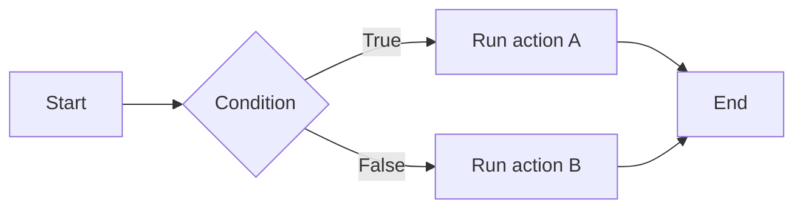
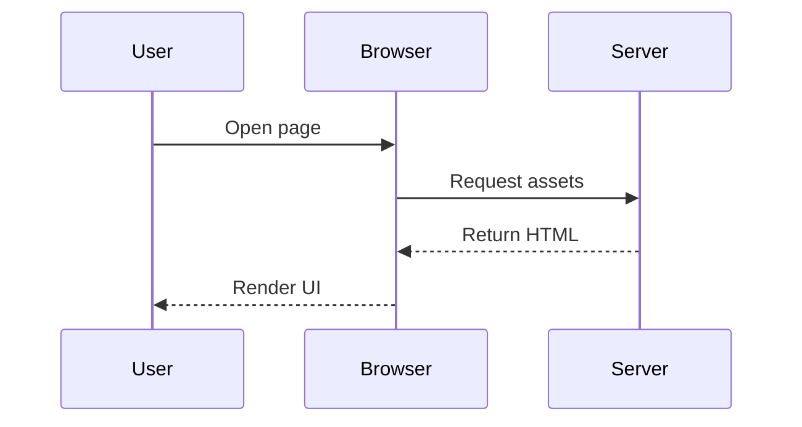
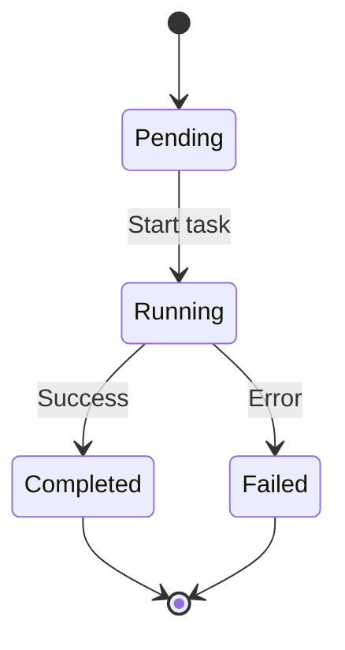

This article demonstrates the core Markdown features supported by the theme, including code highlighting, Typst-powered math rendering, Mermaid diagrams, and common content elements used in long-form writing.

# Markdown

## Headings

The HTML `<h1>` through `<h6>` elements represent six levels of section headings. `<h1>` is the highest level, while `<h6>` is the lowest.

# Heading 1

## Heading 2

### Heading 3

#### Heading 4

##### Heading 5

###### Heading 6

## Paragraphs

This theme is designed for longer reading sessions, so paragraphs should feel comfortable at normal article width without requiring special layout tricks.

Good typography is not only about fonts. It is also about rhythm, spacing, contrast, and how quickly the eye can understand hierarchy while moving down the page.

You can mix English and Chinese content in the same article as well:

我家的后面有一个很大的园，相传叫作百草园。现在是早已并屋子一起卖给朱文公的子孙了，连那最末次的相见也已经隔了七八年，其中似乎确凿只有一些野草；但那时却是我的乐园。

## Blockquotes

Blockquotes are useful for quoted passages, references, or side remarks.

**Blockquote without citation**

> Note that Markdown syntax can still be used inside a blockquote.

**Blockquote with citation**

> Don't communicate by sharing memory, share memory by communicating.
> - Rob Pike[^cite1]

[^cite1]: This quote is commonly attributed to Rob Pike and was mentioned during Gopherfest on November 18, 2015.

## Tables

| Name | Age |
| ---- | --- |
| Bob | 27 |
| Alice | 23 |

### Inline Markdown Inside Tables

| Italic | Bold | Code |
| ---- | ---- | ---- |
| _Italic_ | **Bold** | `Code` |

## Lists

1. First ordered item
2. Second item
   - Nested unordered item
   - Another nested item
   - And one more
3. Third item

- Unordered item
- Another unordered item
- A filler item for spacing

## Links

[Astro](https://astro.build/)

## Images

This is a local article image:


## Other Elements: `abbr`, `sub`, `sup`, `kbd`, `mark`

<abbr title="Graphics Interchange Format">GIF</abbr> is a bitmap image format.

H<sub>2</sub>O

X<sup>n</sup> + Y<sup>n</sup> = Z<sup>n</sup>

Press <kbd>CTRL</kbd> + <kbd>ALT</kbd> + <kbd>Delete</kbd> to end the session.

Most <mark>salamanders</mark> are nocturnal animals.

## Code

### Inline Code

This is `inline code`, and this is `another example`.

### Code Blocks

**Python**

```python
def fibonacci(n):
    """Return the nth Fibonacci number."""
    if n <= 1:
        return n
    return fibonacci(n - 1) + fibonacci(n - 2)

for i in range(10):
    print(f"fib({i}) = {fibonacci(i)}")
```

**JavaScript**

```javascript
async function fetchData(url) {
  try {
    const response = await fetch(url);
    const data = await response.json();
    return data;
  } catch (error) {
    console.error("Fetch error:", error);
    throw error;
  }
}

fetchData("https://api.example.com/data")
  .then((data) => console.log(data))
  .catch((err) => console.error(err));
```

**Go**

```go
package main

import "fmt"

func quickSort(arr []int) []int {
    if len(arr) <= 1 {
        return arr
    }

    pivot := arr[len(arr)/2]
    left := make([]int, 0)
    right := make([]int, 0)

    for _, v := range arr {
        if v < pivot {
            left = append(left, v)
        } else if v > pivot {
            right = append(right, v)
        }
    }

    return append(append(quickSort(left), pivot), quickSort(right)...)
}

func main() {
    arr := []int{3, 6, 8, 10, 1, 2, 1}
    fmt.Println(quickSort(arr))
}
```

---

# Signature Features

## Typst Math

### Inline Math

Here is an inline formula: $E = m c^2$.

You can also write more complex expressions like $sum_(i = 1)^n i = (n(n + 1))/2$ or limits such as $lim_(x -> infinity) (1 + 1/x)^x = e$.

### Display Math

$$
integral_0^infinity e^(-x^2) d x = sqrt(pi)/2
$$

$$
f(x) &= x^2 + 2 x + 1 \
&= (x + 1)^2 \
&= sum_(k = 0)^2 binom(2, k) x^k
$$

$$
EE [X] = sum_(i = 1)^n x_i p_i quad "where" quad sum_(i = 1)^n p_i = 1
$$

Matrix example:

$$
A = mat(a_11, a_12, a_13;
a_21, a_22, a_23;
a_31, a_32, a_33)
quad
d e t(A) = sum_(sigma in S_n) "sgn" (sigma) product_(i = 1)^n a_(i, sigma(i))
$$

### Typst Code Block

```typst
#show title: set text(size: 17pt)
#show title: set align(center)

#title[
  A Fluid Dynamic Model
  for Glacier Flow
]

#grid(
  columns: (1fr, 1fr),
  align(center)[
    Therese Tungsten \
    Artos Institute \
    #link("mailto:tung@artos.edu")
  ],
  align(center)[
    Dr. John Doe \
    Artos Institute \
    #link("mailto:doe@artos.edu")
  ]
)

== Introduction
In this report, we will explore the
various factors that influence _fluid
dynamics_ in glaciers and how they
contribute to the formation and
behaviour of these natural structures.

Anyone caught using formulas such as $sqrt(x+y)=sqrt(x)+sqrt(y)$
or $1/(x+y) = 1/x + 1/y$ will fail.

The binomial theorem is
$ (x+y)^n=sum_(k=0)^n binom(n, k) x^k y^(n-k). $
```

## Mermaid Diagrams

**Flowchart**



**Sequence Diagram**



**State Diagram**



## Why Keep a Showcase Article?

For a theme repository, a showcase article is useful for two reasons:

- It acts as a visual regression sample for typography and content styling.
- It gives users a concrete example of what the theme supports out of the box.

If you are using this repository as your own site starter, you can keep this post as a reference or remove it after adding your own content.
