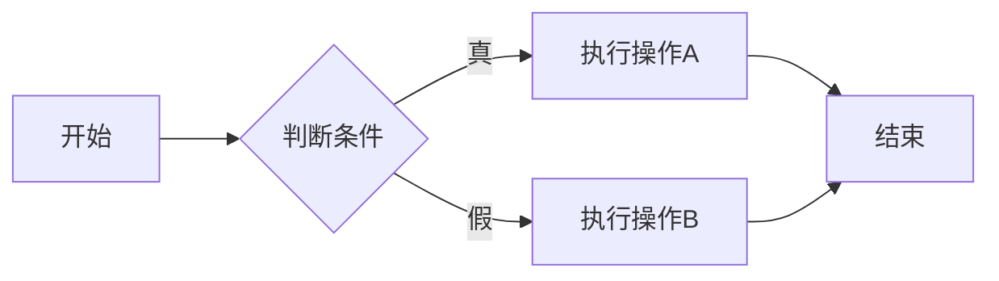
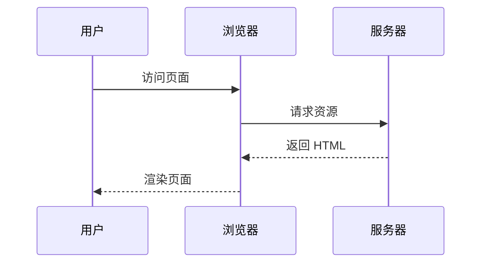
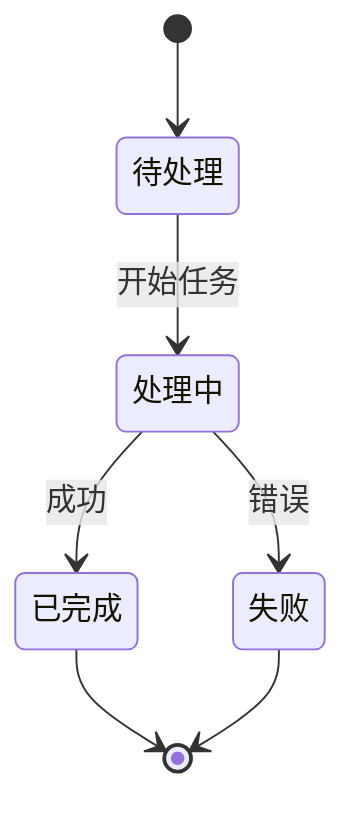

本文展示了支持的 Markdown 基础语法和特色功能，包括代码高亮、Typst 数学公式渲染、Mermaid 图表生成等核心能力。

# Markdown

## 标题

以下HTML `<h1>`—`<h6>` 元素代表六个级别的章节标题。`<h1>` 是最高级别的章节标题，而 `<h6>` 是最低级别的章节标题。

# 标题1

## 标题2

### 标题3

#### 标题4

##### 标题5

###### 标题6

## 段落

Xerum, quo qui aut unt expliquam qui dolut labo. Aque venitatiusda cum, voluptionse latur sitiae dolessi aut parist aut dollo enim qui voluptate ma dolestendit peritin re plis aut quas inctum laceat est volestemque commosa as cus endigna tectur, offic to cor sequas etum rerum idem sintibus eiur? Quianimin porecus evelectur, cum que nis nust voloribus ratem aut omnimi, sitatur? Quiatem. Nam, omnis sum am facea corem alique molestrunt et eos evelece arcillit ut aut eos eos nus, sin conecerem erum fuga. Ri oditatquam, ad quibus unda veliamenimin cusam et facea ipsamus es exerum sitate dolores editium rerore eost, temped molorro ratiae volorro te reribus dolorer sperchicium faceata tiustia prat.

Itatur? Quiatae cullecum rem ent aut odis in re eossequodi nonsequ idebis ne sapicia is sinveli squiatum, core et que aut hariosam ex eat.

我家的后面有一个很大的园，相传叫作百草园。现在是早已并屋子一起卖给朱文公的子孙2了，连那最末次的相见也已经隔了七八年，其中似乎确凿只有一些野草；但那时却是我的乐园。
不必说碧绿的菜畦，光滑的石井栏，高大的皂荚树，紫红的桑椹；也不必说鸣蝉在树叶里长吟，肥胖的黄蜂伏在菜花上，轻捷的叫天子（云雀）忽然从草间直窜向云霄里去了。单是周围的短短的泥墙根一带，就有无限趣味。油蛉在这里低唱，蟋蟀们在这里弹琴。翻开断砖来，有时会遇见蜈蚣；还有斑蝥，倘若用手指按住它的脊梁，便会啪的一声，从后窍喷出一阵烟雾。何首乌藤和木莲藤缠络着，木莲有莲房一般的果实，何首乌有臃肿的根。有人说，何首乌根是有像人形的，吃了便可以成仙，我于是常常拔它起来，牵连不断地拔起来，也曾因此弄坏了泥墙，却从来没有见过有一块根像人样。如果不怕刺，还可以摘到覆盆子，像小珊瑚珠攒成的小球，又酸又甜，色味都比桑椹要好得远。

## 块引用

块引用表示从其他来源引用的内容，可以用于位于 `footer` 或 `cite` 元素内的引文，并且可以表示一些补充说明（例如注释和缩写）。

**没有参考链接的块引用**

> Tiam, ad mint andaepu dandae nostion secatur sequo quae.
> **Note** that you can use _Markdown syntax_ within a blockquote.

**有参考链接的块引用**

> Don't communicate by sharing memory, share memory by communicating.
> — Rob Pike[^cite1]

[^cite1]: 上述引文摘自 Rob Pike 在 2015 年 11 月 18 日 Gopherfest 期间的[谈论"什么都没有"](https://www.youtube.com/watch?v=PAAkCSZUG1c)。

## 表格

| 姓名  | 年龄 |
| ----- | ---- |
| Bob   | 27   |
| Alice | 23   |

### 表格内的内联 Markdown

| 斜体         | 粗体         | 代码       |
| ------------ | ------------ | ---------- |
| _斜体Italic_ | **粗体Bold** | `代码C0de` |

## 列表

1. 这是有序的第一项
2. 第二项
   - 无序列表项
   - 另一项
   - 还有一项
3. 第三项

- 这是无序的
- 无序的
- 凑数

## 链接

[Vellume](https://example.com/)

## 图片

这是一张图片


## 其他元素 — abbr、sub、sup、kbd、mark

<abbr title="图形交换格式">GIF</abbr> 是一种位图图像格式。

H<sub>2</sub>O

X<sup>n</sup> + Y<sup>n</sup> = Z<sup>n</sup>

按下<kbd>CTRL</kbd>+<kbd>ALT</kbd>+<kbd>Delete</kbd>结束会话。

大多数<mark>蝾螈</mark>属于夜行性动物，以捕食昆虫、蠕虫及其他小型生物为生。

## 代码

### 内联代码

这是`内联代码`，这是`另一个`。

### 代码块

**Python 示例**

```python
def fibonacci(n):
    """计算斐波那契数列的第 n 项"""
    if n <= 1:
        return n
    return fibonacci(n-1) + fibonacci(n-2)

# 计算前 10 项
for i in range(10):
    print(f"fib({i}) = {fibonacci(i)}")
```

**JavaScript 示例**

```javascript
// 异步获取数据
async function fetchData(url) {
  try {
    const response = await fetch(url);
    const data = await response.json();
    return data;
  } catch (error) {
    console.error('Fetch error:', error);
    throw error;
  }
}

// 使用示例
fetchData('https://api.example.com/data')
  .then(data => console.log(data))
  .catch(err => console.error(err));
```

**Go 示例**

```go
package main

import "fmt"

func quickSort(arr []int) []int {
    if len(arr) <= 1 {
        return arr
    }

    pivot := arr[len(arr)/2]
    left := make([]int, 0)
    right := make([]int, 0)

    for _, v := range arr {
        if v < pivot {
            left = append(left, v)
        } else if v > pivot {
            right = append(right, v)
        }
    }

    return append(append(quickSort(left), pivot), quickSort(right)...)
}

func main() {
    arr := []int{3, 6, 8, 10, 1, 2, 1}
    fmt.Println(quickSort(arr))
}
```

---

# 特色功能

## Typst 数学公式

### 行内公式

这是行内公式 $E = m c^2$ 的示例，也可以写更复杂的公式如 $sum_(i = 1)^n i = (n(n + 1))/2$。极限表示 $lim_(x -> infinity) (1 + 1/x)^x = e$，积分表示 $integral_a^b f(x) d x = F(b) - F(a)$。

### 块级公式

$$
integral_0^infinity e^(-x^2) d x = sqrt(pi)/2
$$

$$
f(x) &= x^2 + 2 x + 1 \
&= (x + 1)^2 \
&= sum_(k = 0)^2 binom(2, k) x^k
$$

$$
EE [X] = sum_(i = 1)^n x_i p_i quad "其中" quad sum_(i = 1)^n p_i = 1
$$

矩阵示例：

$$
A = mat(a_11, a_12, a_13;
a_21, a_22, a_23;
a_31, a_32, a_33)
quad
d e t(A) = sum_(sigma in S_n) "sgn" (sigma) product_(i = 1)^n a_(i, sigma(i))
$$

### Typst 代码块

```typst
#show title: set text(size: 17pt)
#show title: set align(center)

#title[
  A Fluid Dynamic Model
  for Glacier Flow
]

#grid(
  columns: (1fr, 1fr),
  align(center)[
    Therese Tungsten \
    Artos Institute \
    #link("mailto:tung@artos.edu")
  ],
  align(center)[
    Dr. John Doe \
    Artos Institute \
    #link("mailto:doe@artos.edu")
  ]
)


== Introduction
In this report, we will explore the
various factors that influence _fluid
dynamics_ in glaciers and how they
contribute to the formation and
behaviour of these natural structures.

There now is your insular city of the Manhattoes, belted round by
wharves as Indian isles by coral reefs - commerce surrounds it with
her surf. Right and left, the streets take you waterward. Its extreme
down-town is the battery, where that noble mole is washed by waves,
and cooled by breezes, which a few hours previous were out of sight of
land. Look at the crowds of water-gazers there.

Anyone caught using formulas such as $sqrt(x+y)=sqrt(x)+sqrt(y)$
or $1/(x+y) = 1/x + 1/y$ will fail.

The binomial theorem is
$ (x+y)^n=sum_(k=0)^n binom(n, k) x^k y^(n-k). $

A favorite sum of most mathematicians is
$ sum_(n=1)^oo 1/n^2 = pi^2 / 6. $

Likewise a popular integral is
$ integral_(-oo)^oo e^(-x^2) dif x = sqrt(pi) $

*Theorem 0.1.*
  _The square of any real number is non-negative._

_Proof._
  Any real number $x$ satisfies $x > 0$, $x = 0$, or $x < 0$. If $x = 0$,
  then $x^2 = 0 >= 0$. If $x > 0$ then as a positive time a positive is
  positive we have $x^2 = x x > 0$. If $x < 0$ then $−x > 0$ and so by
  what we have just done $x^2 = (−x)^2 > 0$. So in all cases $x^2 ≥ 0$.

= Introduction
This is a new section.
You can use tables like @solids.

#figure(
  table(
    columns: (1fr, auto, auto),
    inset: 5pt,
    align: horizon,
    table.header(
      [], [*Area*], [*Parameters*]
    ),
    [*Cylinder*],
    $ pi h (D^2 - d^2) / 4 $,
    [$h$: height \
     $D$: outer radius \
     $d$: inner radius],
    [*Tetrahedron*],
    $ sqrt(2) / 12 a^3 $,
    [$a$: edge length]
  ),
  caption: "Solids",
) <solids>

== Things that need to be done
Prove theorems, such as this.

*Theorem 1.1.* 
_The Riemann hypothesis is true._ 

_Proof_ This is left as an exercise to the reader, given the complexity of the theorem.

= Background
#lorem(40)

```

## Mermaid 图表

**流程图**：



**时序图**：



**状态图**：


